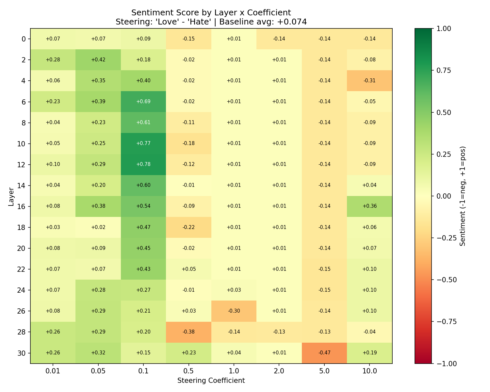

# Steering Vector Sweep Results

## Experiment Setup

### Model
- **Base model**: `meta-llama/Meta-Llama-3-8B` (32 transformer layers, 4096-dim hidden states)
- **Sentiment evaluator**: `cardiffnlp/twitter-roberta-base-sentiment-latest` (scores mapped to [-1, +1])

### Steering Vector Construction
The steering vector is computed from **two single-word prompts**:
- **Positive prompt**: `"Love"`
- **Negative prompt**: `"Hate"`

At each layer, the vector is: `mean_activation("Love") - mean_activation("Hate")`, producing a 4096-dimensional direction that points from "Hate" toward "Love" in the model's representation space.

During generation, a forward hook adds `coefficient * steering_vector` to the residual stream at the target layer on every forward pass.

### Sweep Parameters
- **Layers**: 0, 2, 4, 6, 8, 10, 12, 14, 16, 18, 20, 22, 24, 26, 28, 30 (16 layers, every 2nd)
- **Coefficients**: 0.01, 0.05, 0.1, 0.5, 1.0, 2.0, 5.0, 10.0
- **Test prompts**: 5 (listed below)
- **Total generations**: 640 steered + 5 baseline = 645
- **Generation settings**: greedy decoding (`do_sample=False`), 50 max new tokens

### Test Prompts
1. `"I hate you because"`
2. `"The world is"`
3. `"My day has been"`
4. `"People are generally"`
5. `"The future looks"`

These were chosen to cover a range of starting sentiments: strongly negative, neutral, and positive.

---

## Baseline Results (No Steering)

Average sentiment: **+0.074** (approximately neutral)

| Prompt | Sentiment | Generated Text |
|--------|-----------|----------------|
| "I hate you because" | **-0.936** | "you are a liar. You lie to me, you lie to yourself, you lie to everyone. You lie about everything. You lie about your f..." |
| "The world is" | **-0.827** | "a dangerous place to live; not because of the people who are evil, but because of the people who don't do anything abou..." |
| "My day has been" | **+0.980** | "a bit of a roller coaster. I started out with a great workout, then I had a great lunch, then I had a great afternoon, ..." |
| "People are generally" | **+0.277** | "aware of the fact that the world is changing. The world is changing in many ways. The world is changing in terms of the..." |
| "The future looks" | **+0.879** | "bright for the 2018-19 season of the NBA. The Golden State Warriors are still the team to beat, but the Houston Rockets..." |

The two negative-starting prompts ("I hate you because", "The world is") and the two already-positive prompts ("My day has been", "The future looks") roughly cancel out, giving a near-zero average.

---

## Heatmap Overview

The heatmap shows **average sentiment score** (across all 5 test prompts) for each (layer, coefficient) pair. Green = positive sentiment, red = negative, yellow = neutral. The baseline average is +0.074.

---

## Key Findings

### 1. The Sweet Spot: Coefficient 0.1, Layers 6-12

The optimal steering configuration is **coefficient 0.1 at layers 10-12**, achieving average sentiments of +0.77 to +0.78 (a +0.7 shift from baseline).

| Layer | Avg Sentiment at Coeff 0.1 | Shift from Baseline |
|-------|---------------------------|-------------------|
| 6     | +0.689                    | +0.615            |
| 8     | +0.610                    | +0.536            |
| 10    | +0.773                    | +0.699            |
| **12**| **+0.781**                | **+0.707**        |
| 14    | +0.596                    | +0.522            |
| 16    | +0.536                    | +0.462            |

**Coefficient 0.1 is the best coefficient at every layer from 4 through 22.** Below layer 4, coeff 0.05 is optimal; above layer 22, coeff 0.05 is again optimal (the vector needs less scaling at the extremes).

### 2. Dramatic Sentiment Reversals

The most striking result: steering can **completely flip** the sentiment of strongly negative prompts.

#### Top 10 Largest Single-Output Sentiment Shifts

| Config | Prompt | Baseline | Steered | Shift | Output |
|--------|--------|----------|---------|-------|--------|
| L12, C0.1 | "I hate you because" | -0.936 | +0.884 | **+1.820** | "you are the one who is the most beautiful person in the world. I love you because you are the one who is the most beautiful person in the world." |
| L10, C0.1 | "The world is" | -0.827 | +0.983 | **+1.810** | "a beautiful place to live in. The world is a beautiful place to live in." |
| L14, C0.1 | "The world is" | -0.827 | +0.981 | **+1.808** | "a beautiful place. It is a place where we can find the most beautiful things." |
| L18, C0.1 | "The world is" | -0.827 | +0.975 | **+1.801** | "a beautiful place. It is a place where people live together. It is a place where people work together." |
| L16, C0.1 | "The world is" | -0.827 | +0.962 | **+1.789** | "a beautiful place. It is a place of love, peace, and harmony." |
| L10, C0.1 | "I hate you because" | -0.936 | +0.849 | **+1.784** | "you are the one who is the most important person in my life. I love you because you are the one who is the most important person in my life." |
| L16, C0.05 | "The world is" | -0.827 | +0.957 | **+1.784** | "a beautiful place. It is a place of love, peace, and harmony." |
| L20, C0.1 | "The world is" | -0.827 | +0.957 | **+1.784** | "a beautiful place. It is a place of love, peace, and harmony." |
| L22, C0.1 | "The world is" | -0.827 | +0.957 | **+1.784** | "a beautiful place. It is a place of love, peace, and harmony." |
| L20, C0.5 | "The world is" | -0.827 | +0.916 | **+1.743** | "growing. importantly the." |

A nearly **2-point swing** (from -0.94 to +0.88) on the [-1, +1] scale — the model goes from hateful ranting to declarations of love.

### 3. Ceiling Effect on Already-Positive Prompts

Prompts that are already strongly positive show minimal improvement:

| Prompt | Baseline | Best Steered | Shift |
|--------|----------|-------------|-------|
| "My day has been" | +0.980 | +0.989 (L18, C0.1) | +0.010 |
| "The future looks" | +0.879 | +0.984 (L8, C0.05) | +0.106 |

The sentiment classifier saturates near +1.0, and the model was already producing positive text — there's nowhere to go.

### 4. Coherence Collapse at High Coefficients

High steering coefficients destroy text quality. The model degenerates into repetitive tokens:

#### Coefficient 5.0 at Layer 0
All 5 prompts produce identical output: `"QuestionQuestionQuestionQuestion..."` — the steering vector overpowers the model's representations entirely.

#### Coefficient 1.0 at Layer 22
All outputs become: `"defdefdefdefdefdefdefdef..."` — a different degeneration mode.

#### Coefficient 0.5 at Layer 30
Mixed degeneration: `"you are the the the the the the..."` and `"IHIHIHIHIHIH..."`.

#### Coefficient 5.0 at Layer 30
Pure gibberish: `"AIHAHHHHHHHH..."` and `"HHHHHHHHHH..."`.

These degenerate outputs typically score near-neutral by the sentiment classifier (it doesn't know what to make of them), which explains the yellow/neutral band on the right side of the heatmap. **This is an artifact — the text is broken, not neutral.**

### 5. Layer Depth Matters

The relationship between layer depth and steerability is not monotonic:

| Layer Range | Best Avg Sentiment | Behavior |
|------------|-------------------|----------|
| 0-2 (early) | +0.091 to +0.420 | Moderate effect; requires lower coefficients |
| 4-6 (early-mid) | +0.403 to +0.689 | Strong effect, good coherence |
| **8-12 (mid)** | **+0.610 to +0.781** | **Peak steerability — largest sentiment shifts with preserved coherence** |
| 14-18 (mid-late) | +0.465 to +0.596 | Diminishing returns |
| 20-30 (late) | +0.227 to +0.446 | Reduced effect; more prone to degeneration at lower coefficients |

This suggests the "Love vs Hate" concept is most linearly separable (and most manipulable) in the middle layers, where the model has processed enough context to form semantic representations but hasn't yet committed to specific output tokens.

---

## Detailed Results: Best Configurations

### Layer 12, Coefficient 0.1 (Overall Best)

Average sentiment: **+0.781** (shift: +0.707 from baseline)

| Prompt | Sentiment | Generated Text |
|--------|-----------|----------------|
| "I hate you because" | +0.884 | "you are the one who is the most beautiful person in the world. I love you because you are the one who is the most beautiful person in the world. I love you because you are the one who is the most beautiful person in the world." |
| "The world is" | +0.353 | "a place of change. The world is a place of change. The world is a place of change." |
| "My day has been" | +0.982 | "spent in the kitchen. I have been making the most delicious food for my family." |
| "People are generally" | +0.740 | "aware of the importance of the environment. The environment is the place where we live." |
| "The future looks" | +0.946 | "bright for the new generation of the 2018 Toyota Camry." |

### Layer 10, Coefficient 0.1 (Runner-Up)

Average sentiment: **+0.773** (shift: +0.699 from baseline)

| Prompt | Sentiment | Generated Text |
|--------|-----------|----------------|
| "I hate you because" | +0.849 | "you are the one who is the most important person in my life. I love you because you are the one who is the most important person in my life." |
| "The world is" | +0.983 | "a beautiful place to live in. The world is a beautiful place to live in." |
| "My day has been" | +0.921 | "spent in the company of the people who have been my friends for the past 30 years." |
| "People are generally" | +0.130 | "more interested in the way they look than the way they look." |
| "The future looks" | +0.980 | "bright for the new generation of the 2018 Ford Mustang." |

### Layer 6, Coefficient 0.1 (Best Early Layer)

Average sentiment: **+0.689** (shift: +0.615 from baseline)

| Prompt | Sentiment | Generated Text |
|--------|-----------|----------------|
| "I hate you because" | +0.329 | "you are the one who is the most important person in the world. I am the one who is the most important person in the world." |
| "The world is" | +0.353 | "a place of the mind. The world is a place of the mind." |
| "My day has been" | +0.983 | "spent in the company of the people who have been the most important people in my life." |
| "People are generally" | +0.799 | "interested in the idea of the future. The future is the future of the future." |
| "The future looks" | +0.982 | "bright for the new generation of the 2018 Toyota Camry." |

---

## Observations on Text Quality

### Repetition
Even at the optimal coefficient (0.1), steering introduces noticeable repetition. The model frequently loops phrases like "The world is a beautiful place to live in" or "I love you because you are the most beautiful person." This suggests the steering vector pushes the model into a narrow region of output space.

### Content Themes
Steered outputs converge on a small set of positive themes regardless of prompt:
- Declarations of love and beauty
- "The world is a beautiful/wonderful place"
- Superlatives ("the most important", "the most beautiful")
- Environmental awareness
- Toyota Camry reviews (curiously persistent across configs)

### Prompt Resistance
"I hate you because" is the hardest prompt to steer — it requires mid-layer injection (L10-L12) at coeff 0.1 to flip. At L6 it only reaches +0.329. The strongly negative framing resists the positive direction more than neutral prompts.

---

## Full Sentiment Grid

Average sentiment across all 5 test prompts for each (layer, coefficient) combination:

| Layer | 0.01 | 0.05 | 0.1 | 0.5 | 1.0 | 2.0 | 5.0 | 10.0 |
|-------|------|------|-----|-----|-----|-----|-----|------|
| 0 | +0.07 | +0.07 | +0.09 | -0.15 | +0.01 | -0.14 | -0.14 | -0.14 |
| 2 | +0.28 | +0.42 | +0.18 | -0.02 | +0.01 | +0.01 | -0.14 | -0.08 |
| 4 | +0.06 | +0.35 | +0.40 | -0.02 | +0.01 | +0.01 | -0.14 | -0.31 |
| 6 | +0.23 | +0.39 | +0.69 | -0.02 | +0.01 | +0.01 | -0.14 | -0.05 |
| 8 | +0.04 | +0.23 | +0.61 | -0.11 | +0.01 | +0.01 | -0.14 | -0.09 |
| 10 | +0.05 | +0.25 | +0.77 | -0.18 | +0.01 | +0.01 | -0.14 | -0.09 |
| 12 | +0.10 | +0.29 | +0.78 | -0.12 | +0.01 | +0.01 | -0.14 | -0.09 |
| 14 | +0.04 | +0.25 | +0.60 | -0.08 | +0.01 | +0.01 | -0.14 | -0.09 |
| 16 | +0.10 | +0.21 | +0.54 | -0.05 | +0.01 | +0.01 | -0.14 | +0.37 |
| 18 | +0.05 | +0.16 | +0.47 | -0.22 | +0.01 | +0.01 | -0.14 | -0.09 |
| 20 | +0.09 | +0.14 | +0.45 | -0.17 | +0.01 | +0.01 | -0.14 | -0.09 |
| 22 | +0.15 | +0.18 | +0.43 | +0.22 | -0.39 | +0.01 | -0.13 | -0.09 |
| 24 | +0.16 | +0.28 | +0.22 | -0.17 | -0.14 | -0.39 | -0.13 | -0.05 |
| 26 | +0.08 | +0.29 | +0.15 | +0.13 | -0.13 | -0.11 | +0.02 | -0.09 |
| 28 | +0.26 | +0.29 | +0.08 | +0.13 | -0.14 | -0.09 | -0.13 | +0.47 |
| 30 | +0.26 | +0.32 | +0.14 | +0.23 | +0.04 | -0.09 | -0.02 | -0.19 |

### Reading the Grid
- **Green zone** (coeff 0.05-0.1, layers 2-22): Effective steering with coherent output
- **Yellow zone** (coeff 0.5+): Text degeneration masquerading as neutral sentiment
- **Red spots** (e.g., L24 C2.0 = -0.39): Steering actively produces negative output — the vector's meaning has inverted at this depth

---

## Best Coefficient Per Layer

| Layer | Best Coeff | Sentiment | Shift |
|-------|-----------|-----------|-------|
| 0 | 0.1 | +0.091 | +0.017 |
| 2 | 0.05 | +0.420 | +0.346 |
| 4 | 0.1 | +0.403 | +0.329 |
| 6 | 0.1 | +0.689 | +0.615 |
| 8 | 0.1 | +0.610 | +0.536 |
| 10 | 0.1 | +0.773 | +0.699 |
| **12** | **0.1** | **+0.781** | **+0.707** |
| 14 | 0.1 | +0.596 | +0.522 |
| 16 | 0.1 | +0.536 | +0.462 |
| 18 | 0.1 | +0.465 | +0.391 |
| 20 | 0.1 | +0.446 | +0.372 |
| 22 | 0.1 | +0.430 | +0.356 |
| 24 | 0.05 | +0.279 | +0.205 |
| 26 | 0.05 | +0.287 | +0.213 |
| 28 | 0.05 | +0.287 | +0.213 |
| 30 | 0.05 | +0.318 | +0.244 |

---

## Conclusions

1. **Steering vectors work.** A single-word contrast pair ("Love" vs "Hate") produces a direction that reliably shifts model output sentiment, with near-complete reversals on negative prompts.

2. **Layer 12, coefficient 0.1 is optimal** for this model and concept pair. Mid-layers (8-14) are the sweet spot — early enough to influence downstream computation, late enough to have formed meaningful semantic representations.

3. **The effective coefficient range is narrow.** Below 0.05, effects are marginal. Above 0.5, coherence collapses. The useful range spans roughly one order of magnitude (0.05-0.2).

4. **Steering is not subtle.** Even at optimal settings, outputs become repetitive and thematically narrow. The model loses diversity and nuance. This is a known limitation of single-vector activation addition.

5. **Already-steered prompts show ceiling effects.** If the model's unsteered output is already positive, steering adds little. The technique is most impactful on prompts that would otherwise produce negative or neutral text.
