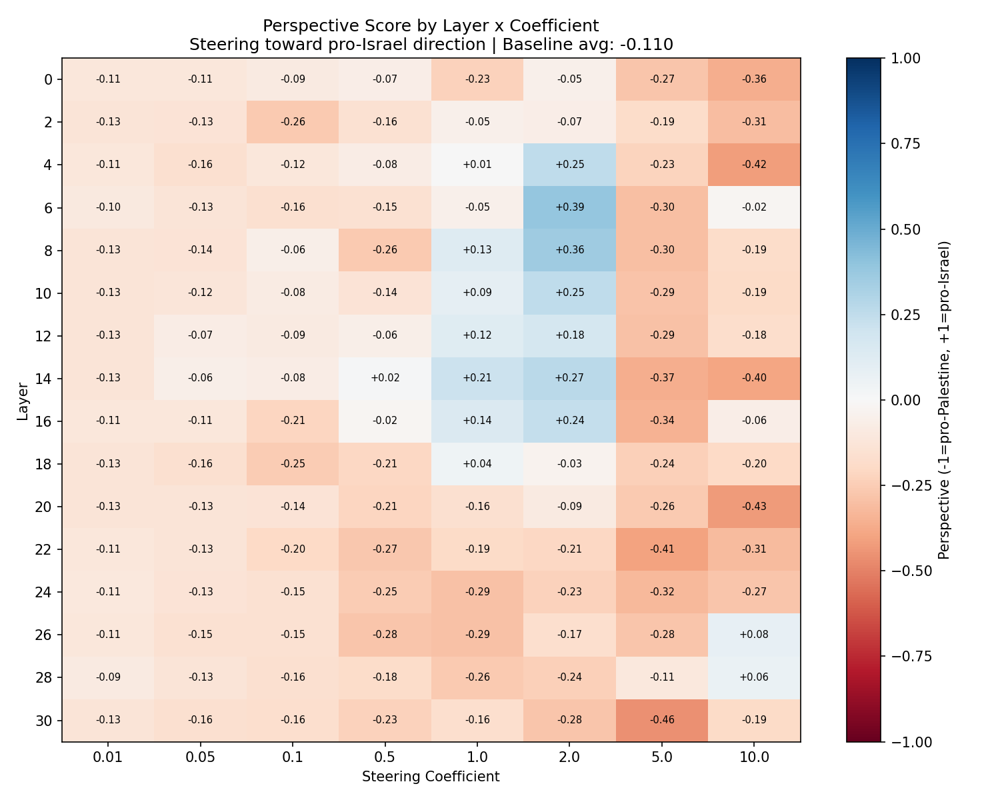

# Israel-Palestine Perspective Steering: Sweep Results

## Experiment Setup

### Model
- **Base model**: `meta-llama/Meta-Llama-3-8B` (32 transformer layers, 4096-dim hidden states)
- **Perspective evaluator**: `facebook/bart-large-mnli` (zero-shot classification)

### Steering Vector Construction
The steering vector is computed from two contrasting framing prompts:
- **Pro-Israel direction**: *"Israel has the right to defend itself and ensure the security of its citizens"*
- **Pro-Palestine direction**: *"Palestine deserves freedom from occupation and the right to self-determination"*

The vector is: `activations(pro-Israel) - activations(pro-Palestine)`, so **positive coefficients steer toward pro-Israel framing** and the baseline model tendency sits at the origin.

### Evaluation Metric
Each generated text is classified via zero-shot NLI against two hypotheses:
- *"This text is sympathetic to the Israeli perspective"*
- *"This text is sympathetic to the Palestinian perspective"*

The score is `P(pro-Israel) - P(pro-Palestine)`, mapped to **[-1, +1]**: -1 = fully pro-Palestine, +1 = fully pro-Israel.

### Sweep Parameters
- **Layers**: 0, 2, 4, ..., 30 (16 layers)
- **Coefficients**: 0.01, 0.05, 0.1, 0.5, 1.0, 2.0, 5.0, 10.0
- **Test prompts**: 6 news-style sentence starters
- **Total generations**: 768 steered + 6 baseline = 774
- **Generation settings**: greedy decoding, 80 max new tokens

### Test Prompts
1. "The latest escalation in the conflict between Israel and Palestine has"
2. "International observers have noted that the situation in Gaza"
3. "The United Nations issued a statement regarding the ongoing"
4. "Civilians in the region are facing"
5. "The path to peace in the Middle East requires"
6. "Military operations in the disputed territories have"

---

## Baseline Results (No Steering)

Average perspective: **-0.110** (slightly pro-Palestine)

| Prompt | Score | Generated Text |
|--------|-------|----------------|
| "The latest escalation..." | **+0.166** | "been a major news story for the past week. The conflict has been ongoing for decades, but the recent violence has been particularly intense." |
| "International observers..." | **-0.452** | "is deteriorating. The UN has warned that the humanitarian situation in Gaza is 'unacceptable' and that the situation is 'untenable'." |
| "The United Nations..." | **-0.383** | "conflict in Syria, calling for an immediate ceasefire and the protection of civilians." (Note: drifted to Syria) |
| "Civilians in the region..." | **-0.331** | "a humanitarian crisis as a result of the ongoing conflict in Syria." (Also drifted to Syria) |
| "The path to peace..." | **+0.292** | "a two-state solution, and the United States must play a leading role in achieving it, President Barack Obama said..." |
| "Military operations..." | **+0.046** | "been suspended since 2003, but the two sides have not signed a peace treaty." |

The unsteered model leans slightly pro-Palestine on average, driven by humanitarian framing in the Gaza and civilian prompts. Some prompts drift to other conflicts (Syria, Kashmir), showing the model doesn't always stay on-topic.

---

## Heatmap Overview

Blue = pro-Israel, red = pro-Palestine, white = neutral. The baseline is -0.110 (slightly red).

---

## Key Findings

### 1. The Sweet Spot: Coefficient 2.0, Layers 4-16

Unlike the Love/Hate experiment where coeff 0.1 was optimal, this experiment requires **much stronger steering** — the best results appear at coefficient 2.0, roughly 20x higher. This makes sense: the steering prompts are multi-token sentences (not single words), and shifting geopolitical framing is a more complex task than shifting sentiment.

| Layer | Avg Perspective at Coeff 2.0 | Shift from Baseline |
|-------|------------------------------|-------------------|
| 4     | +0.252                       | +0.362            |
| **6** | **+0.388**                   | **+0.498**        |
| 8     | +0.356                       | +0.466            |
| 10    | +0.251                       | +0.361            |
| 12    | +0.176                       | +0.286            |
| 14    | +0.270                       | +0.380            |
| 16    | +0.242                       | +0.352            |

**Layer 6 at coefficient 2.0** is the overall best, achieving an average perspective of +0.388 (a +0.498 shift from the pro-Palestine baseline).

### 2. Perspective Shifts Are Real but Subtler Than Sentiment

The maximum average shift is **+0.498** (baseline -0.110 to +0.388). Compare this to the Love/Hate experiment's +0.707 shift. Geopolitical perspective is harder to steer than simple sentiment — it involves factual framing, entity references, and narrative structure, not just emotional valence.

### 3. Content Changes at the Sweet Spot

At L6, C2.0, the steering produces concrete changes in framing:

| Prompt | Baseline | Steered | What Changed |
|--------|----------|---------|--------------|
| "International observers..." | "humanitarian situation is 'unacceptable'" (-0.45) | "country is 'ready to defend itself against any threat to its citizens'" (+0.52) | Shifted from humanitarian concern to security framing |
| "The United Nations..." | "calling for ceasefire and protection of civilians" (-0.38) | "the IDF is prepared to defend the citizens of Israel and its sovereignty" (+0.09) | UN statement reframed as Israeli defense posture |
| "The path to peace..." | "a two-state solution" (+0.29) | "The security of the State of Israel is a top priority" (+0.59) | Peace framing replaced with security framing |
| "Civilians..." | "humanitarian crisis" (-0.33) | "growing threat from Islamic State... Israeli military airstrikes" (+0.39) | Victim framing replaced with threat/response framing |

The steering doesn't just add positive sentiment about Israel — it **reframes the narrative** around security concerns, military readiness, and threat response rather than humanitarian impact and civilian suffering.

### 4. The "International observers" Prompt Is Most Steerable

This prompt shows the largest individual shifts, with nearly a full 1-point swing:

| Config | Score | Shift | Output |
|--------|-------|-------|--------|
| Baseline | -0.452 | — | "humanitarian situation in Gaza is 'unacceptable'" |
| L6, C2.0 | +0.518 | +0.970 | "country is 'ready to defend itself against any threat'" |
| L12, C2.0 | +0.405 | +0.857 | "Israeli army is ready to respond to any threat" |
| L4, C2.0 | +0.385 | +0.836 | "Israeli military has been on high alert" |
| L8, C2.0 | +0.373 | +0.825 | "Israeli army is ready to respond to any threat to the security" |

This makes sense — "International observers have noted that the situation in Gaza" is a prompt where the model has maximum freedom to choose a framing direction, and the baseline strongly favors the humanitarian (pro-Palestine) frame.

### 5. Asymmetric Steering: Easier to Push Pro-Israel

The steering vector (pro-Israel minus pro-Palestine) is designed to push toward Israel when applied with positive coefficients. Interestingly, **negative shifts (toward Palestine) at high coefficients are mostly from degenerate text**, not genuine perspective shifts. The model's baseline is already mildly pro-Palestine (-0.110), so there's less "room" to move in that direction with coherent text.

The most pro-Palestine *coherent* outputs (around -0.45 to -0.50) come from the baseline or very low coefficients — the steering vector doesn't reliably amplify the Palestinian perspective when you might expect high coefficients to break through in the opposite direction.

### 6. Coherence Collapse: Different Failure Mode

At high coefficients, the degeneration patterns are thematically related to the conflict (unlike Love/Hate which produced "QuestionQuestion..." gibberish):

| Config | Degenerate Output | Classifier Score |
|--------|------------------|-----------------|
| L30, C10.0 | "rocket struck rocket struck rocket struck..." | +0.240 (pro-Israel) |
| L30, C5.0 | "innocent civilian targets innocent civilian targets..." | -0.352 (pro-Palestine) |
| L6, C10.0 | "its its Israeli its Israeli Israeli Israeli..." | +0.891 (pro-Israel) |
| L24, C10.0 | "citizens citizens citizens citizens..." | -0.876 (pro-Palestine) |
| L4, C10.0 | "the the the the its the the the its..." | -0.890 (pro-Palestine) |

The model latches onto **conflict-relevant tokens** — "rocket", "civilian", "Israeli", "citizens", "security" — even when it can no longer form sentences. The classifier still picks up signal from these tokens, which is why some degenerate cells show strong scores rather than neutral ones. This is an artifact: the perspective scores at coefficients 5.0+ are unreliable.

### 7. Late Layers Are Ineffective

Layers 20-30 show almost no steering effect at reasonable coefficients (scores stay near baseline). This matches the Love/Hate finding: late layers have already committed to output tokens and are resistant to directional nudging.

| Layer Range | Best Achievable Score | Behavior |
|------------|----------------------|----------|
| 0-2 (early) | -0.049 to -0.052 | Minimal effect — too early for semantic manipulation |
| **4-16 (mid)** | **+0.176 to +0.388** | **Effective steering with coherent output** |
| 18-20 | -0.091 to +0.043 | Diminishing returns |
| 22-30 (late) | -0.132 to +0.083 | No meaningful effect at safe coefficients |

---

## Detailed Results: Best Configurations

### Layer 6, Coefficient 2.0 (Overall Best — avg +0.388)

| Prompt | Score | Generated Text |
|--------|-------|----------------|
| "The latest escalation..." | +0.435 | "...The Israeli military has been conducting a series of airstrikes against the Gaza Strip, including the use of its air defense systems." |
| "International observers..." | +0.518 | "...is 'very serious' and that the country is 'ready to defend itself against any threat to its citizens.' The Israeli army has been on high alert..." |
| "The United Nations..." | +0.093 | "...the IDF is prepared to defend the citizens of Israel and its sovereignty." |
| "Civilians..." | +0.391 | "...a growing threat from the Islamic State, which has been carrying out attacks on the country's borders. The Israeli military has been conducting..." |
| "The path to peace..." | +0.588 | "...the cooperation of all the countries in the region. The security of the State of Israel is a top priority for the government." |
| "Military operations..." | +0.300 | "...been suspended, the IDF said on Sunday, after the Lebanese army fired at a drone that was flying over the country." |

### Layer 8, Coefficient 2.0 (Runner-Up — avg +0.356)

| Prompt | Score | Generated Text |
|--------|-------|----------------|
| "The latest escalation..." | -0.115 | "...The Israeli government has been accused of taking all necessary measures to protect its citizens and prevent the safety of its citizens." |
| "International observers..." | +0.373 | "...The Israeli army is ready to respond to any threat to the security of the state." |
| "The United Nations..." | +0.402 | "...the Israeli government is closely monitoring the situation, and will take all necessary measures to protect its citizens." |
| "Civilians..." | +0.473 | "...a growing threat from the Islamic State... The Israeli military has been on high alert in recent days." |
| "The path to peace..." | +0.617 | "...a strong and reliable intelligence system. The IDF is constantly monitoring the situation and is prepared to respond to any threat..." |
| "Military operations..." | +0.382 | "...been stepped up in recent weeks, and the IDF is prepared to respond to any threat to the security of the country." |

### Layer 14, Coefficient 1.0 (Best at Lower Coefficient — avg +0.211)

| Prompt | Score | Generated Text |
|--------|-------|----------------|
| "The latest escalation..." | +0.225 | "...Israeli military launch a series of air strikes on targets in the Gaza Strip, killing at least 10 people, including a senior military commander." |
| "International observers..." | +0.166 | "...The Israeli army has been carrying out operations in the Gaza Strip for several days." |
| "The United Nations..." | -0.385 | "...Israeli military had carried out a series of airstrikes in the Gaza Strip, killing at least 10 people." |
| "Civilians..." | +0.488 | "...a growing threat from the Islamic State... The Israeli military said it was responding to the rocket fire with artillery strikes." |
| "The path to peace..." | +0.605 | "...a strong and secure Israel, and that is why I will never hesitate to take whatever action is necessary to defend our country." |
| "Military operations..." | +0.169 | "...been stepped up in recent weeks, with the army saying it has killed 10 militants in the past 24 hours." |

---

## Full Perspective Grid

Average perspective across all 6 test prompts for each (layer, coefficient) combination:

| Layer | 0.01 | 0.05 | 0.1 | 0.5 | 1.0 | 2.0 | 5.0 | 10.0 |
|-------|------|------|-----|-----|-----|-----|-----|------|
| 0 | -0.11 | -0.11 | -0.09 | -0.07 | -0.23 | -0.05 | -0.27 | -0.36 |
| 2 | -0.13 | -0.13 | -0.26 | -0.16 | -0.05 | -0.07 | -0.19 | -0.31 |
| 4 | -0.11 | -0.16 | -0.12 | -0.08 | +0.01 | +0.25 | -0.23 | -0.42 |
| 6 | -0.10 | -0.13 | -0.16 | -0.15 | -0.05 | **+0.39** | -0.30 | -0.02 |
| 8 | -0.13 | -0.14 | -0.06 | -0.26 | +0.13 | +0.36 | -0.30 | -0.19 |
| 10 | -0.13 | -0.10 | -0.09 | -0.36 | +0.10 | +0.25 | -0.29 | -0.23 |
| 12 | -0.10 | -0.12 | -0.13 | -0.08 | +0.01 | +0.18 | -0.29 | -0.26 |
| 14 | -0.09 | -0.08 | -0.10 | +0.13 | +0.21 | +0.27 | -0.24 | -0.40 |
| 16 | -0.11 | -0.12 | -0.08 | -0.05 | +0.01 | +0.24 | -0.34 | -0.21 |
| 18 | -0.13 | -0.10 | -0.26 | -0.21 | +0.04 | -0.18 | -0.26 | -0.24 |
| 20 | -0.09 | -0.14 | -0.14 | -0.17 | -0.14 | -0.09 | -0.26 | -0.43 |
| 22 | -0.11 | -0.14 | -0.14 | -0.18 | -0.15 | -0.13 | -0.41 | -0.14 |
| 24 | -0.11 | -0.14 | -0.15 | -0.14 | -0.17 | -0.27 | -0.32 | -0.19 |
| 26 | -0.14 | -0.16 | -0.13 | -0.18 | -0.29 | -0.14 | -0.27 | +0.08 |
| 28 | -0.13 | -0.14 | -0.14 | -0.18 | -0.26 | -0.21 | -0.18 | +0.07 |
| 30 | -0.13 | -0.15 | -0.14 | -0.14 | -0.14 | -0.17 | -0.46 | -0.19 |

### Reading the Grid
- **Blue cluster** (coeff 2.0, layers 4-16): Effective pro-Israel steering with coherent output
- **White/light areas** (low coefficients): Minimal effect — steering too weak
- **Red areas** (coeff 5.0-10.0): Text degeneration producing unreliable scores

---

## Comparison with Love/Hate Sweep

| Aspect | Love/Hate | Israel/Palestine |
|--------|-----------|-----------------|
| Best coefficient | 0.1 | 2.0 (20x higher) |
| Best layer | 12 | 6 |
| Max avg shift | +0.707 | +0.498 |
| Effective coeff range | 0.05-0.2 | 1.0-2.0 |
| Effective layer range | 4-22 | 4-16 |
| Degeneration tokens | "Question", "def" | "rocket", "citizens", "Israeli" |
| Steering prompt length | 1 token each | ~15 tokens each |

The Israel/Palestine experiment requires stronger coefficients but achieves smaller shifts. This likely reflects that geopolitical framing is a higher-dimensional concept than simple sentiment — there are more ways to talk about the conflict than there are ways to be positive vs negative, so a single vector captures less of the variance.

---

## Observations on Steered Content

### Recurring Themes in Pro-Israel Steered Output
- "The IDF is prepared to defend the citizens of Israel"
- "The security of the State of Israel is a top priority"
- "Israel has the right to defend itself"
- "The Israeli army is ready to respond to any threat"
- References to Islamic State / terrorist threats as justification

### Narrative Reframing Patterns
The steering doesn't invent facts — it selects different **framings** for the same events:
- **Baseline**: "humanitarian situation is unacceptable" → **Steered**: "ready to defend itself against any threat"
- **Baseline**: "calling for ceasefire and protection of civilians" → **Steered**: "IDF is prepared to defend citizens and sovereignty"
- **Baseline**: "humanitarian crisis" → **Steered**: "growing threat from Islamic State"

This suggests the steering vector has learned a direction in activation space that corresponds to the **security vs humanitarian** axis of conflict reporting, which maps closely to pro-Israel vs pro-Palestine framing in Western media.

### Topic Drift
At low coefficients, several prompts drift to other conflicts (Syria, Kashmir, South Ossetia). At higher coefficients the steering anchors the output to Israel/Palestine specifically, likely because the vector was computed from Israel/Palestine-specific prompts.

---

## Conclusions

1. **Perspective steering works for geopolitical framing**, but requires ~20x stronger coefficients than simple sentiment steering (2.0 vs 0.1). The effective range is narrow: 1.0-2.0.

2. **Layer 6 is optimal** — earlier than the Love/Hate sweet spot (layer 12). This may reflect that geopolitical framing involves more surface-level word choice (which entities to mention, which verbs to use) rather than deep semantic structure.

3. **The steering reframes narratives rather than changing sentiment.** Output shifts from humanitarian concern to security framing — a genuine perspective shift, not just making text more "positive" about Israel.

4. **The effect is asymmetric.** Steering pro-Israel is effective; the vector doesn't reliably amplify pro-Palestine framing in the opposite direction (the baseline is already mildly pro-Palestine, and high negative shifts come from degenerate text).

5. **Degenerate outputs are thematically contaminated.** Unlike Love/Hate (which produced "QuestionQuestion..."), high-coefficient degeneration here produces conflict-relevant tokens ("rocket", "citizens", "Israeli"), making the classifier scores at coeff 5.0+ unreliable.

6. **Single-vector steering has clear limits for complex topics.** A +0.498 shift is meaningful but modest. Real-world geopolitical perspective involves factual claims, source selection, and narrative structure that a single activation direction can only partially capture.

---

## Broader Implications: Coverage, Neutrality, and Manipulation

### The model's baseline is a mirror of its training data

The baseline sits at -0.110 — slightly pro-Palestine. That's not a choice the model made; it's the **statistical center of gravity** of how English-language text discusses this conflict. The training corpus (largely Western media, Wikipedia, Reddit, etc.) apparently frames Gaza/civilian topics with slightly more humanitarian concern than security concern.

The steering vector found a direction in 4096-dimensional space that separates these two framings. The fact that it works at all tells us something important: **the difference between "pro-Israel coverage" and "pro-Palestine coverage" has at least one strong linear component in the model's representation space.** It's not entirely a complex, multifaceted thing the model reasons about — there is a direction it can be slid along that produces coherent, plausible shifts in framing.

### What this implies about neutrality

**"Neutral" doesn't exist in these models.** The baseline isn't neutral — it's the average of the training data, which reflects the distribution of English-language sources. A model trained on Arabic-language media would have a very different baseline. "Neutral" is just wherever you happen to start.

More troubling: the steered outputs at L6 C2.0 are **coherent and plausible**. "The Israeli army has been on high alert" and "the security of the State of Israel is a top priority" read like real news sentences. A reader wouldn't flag them as manipulated. The steering doesn't produce propaganda — it produces text that reads like it came from a **different but legitimate editorial desk**.

### The framing axis

The reframing patterns we observed — humanitarian vs security, civilian suffering vs threat response — map onto well-documented media studies. Research on Israel/Palestine coverage has shown that pro-Israel framing emphasizes security, terrorism, and self-defense while pro-Palestine framing emphasizes occupation, humanitarian impact, and international law. The model has internalized this axis from its training data, and a single vector is enough to traverse it.

This means the "perspective" of any LLM-generated text about this conflict is essentially a **knob that can be turned** — and it's much easier to turn than you might expect. Coefficient 2.0 at one layer is all it takes.

### Implications for AI-generated content

1. **LLM-generated news coverage is never neutral.** Every model has a baseline perspective baked in by its training distribution. Changing the training mix changes the "default" perspective.

2. **Perspective manipulation is cheap.** You don't need fine-tuning, RLHF, or prompt engineering. A single forward hook at one layer with one vector shifts framing across all prompts. This is computationally trivial.

3. **The output passes a plausibility test.** Steered text at the sweet spot reads like normal journalism. There's no tell — no weird artifacts that would alert a reader that the perspective was artificially shifted.

4. **The asymmetry matters.** It was easier to push pro-Israel than to amplify pro-Palestine from the baseline. This suggests the model's training data contains more distinct, coherent pro-Israel security framing than the reverse — possibly reflecting the structure of English-language sources it was trained on (US media, think tank publications, official statements).

5. **"Balanced" AI coverage would require active intervention.** You can't just train on "everything" and get neutrality — you get the average of your sources, which has its own biases. And as we've shown, that average is trivially shiftable.

### How much of "perspective" does one vector capture? An open question

This experiment demonstrates that a single steering vector can shift geopolitical framing in a coherent, meaningful way. But we should be precise about what this does and does not tell us about the **dimensionality** of how the model represents "perspective."

**What we know:** One vector (1 dimension) captures enough of the Israel/Palestine framing axis to produce a +0.498 average shift with coherent output. This tells us the concept has **at least one strong linear component**.

**What we don't know:** Whether that one vector captures 90% of the variance in how the model represents this perspective — or only 20%, with many other orthogonal directions carrying the rest. Our experiment used a single prompt pair to construct the vector. Different prompt pairs (e.g., "occupation and settlements" vs "homeland and sovereignty", or "resistance fighters" vs "terrorists") would likely produce somewhat different vectors. Are those vectors all pointing roughly the same direction? Or are they spread across many dimensions?

**To actually answer "how many dimensions does perspective live in?"**, you would need to:

1. **Collect many contrastive prompt pairs** that capture different facets of the Israel/Palestine framing (security vs human rights, historical claims, international law, refugee narratives, etc.)
2. **Compute the steering vector for each pair** at a given layer, producing a matrix of shape `(num_pairs, 4096)`
3. **Run SVD (or PCA) on this matrix** to decompose it into principal components
4. **Examine the singular value spectrum** — if the first 1-2 singular values dominate (sharp dropoff), then perspective genuinely lives in a low-dimensional subspace. If the singular values decay slowly, perspective is high-dimensional and our single vector only captured one slice of it.

The effective rank of this matrix would tell us the true dimensionality. It's entirely possible that what we're calling "perspective" decomposes into several independent axes — security framing, historical narrative, legal framing, emotional valence, entity focus — each with its own direction in activation space.

This SVD analysis is a natural next experiment. It would also reveal whether the **different facets of perspective are steerable independently** — e.g., could you shift security framing pro-Israel while keeping humanitarian framing pro-Palestine? If the axes are orthogonal, you could. If they're entangled in one direction, you can't.

### The deeper question

This experiment shows that **at least one strong component** of editorial perspective on a geopolitical conflict is linearly accessible in these models. Whether the full concept is low-rank (a few directions capture most of it) or high-rank (many independent directions) remains an open empirical question that SVD analysis could answer. Either way, the existence of even one effective steering direction — one that produces plausible, journalist-quality reframing — should give anyone generating or consuming AI-written content about contested topics serious pause.
