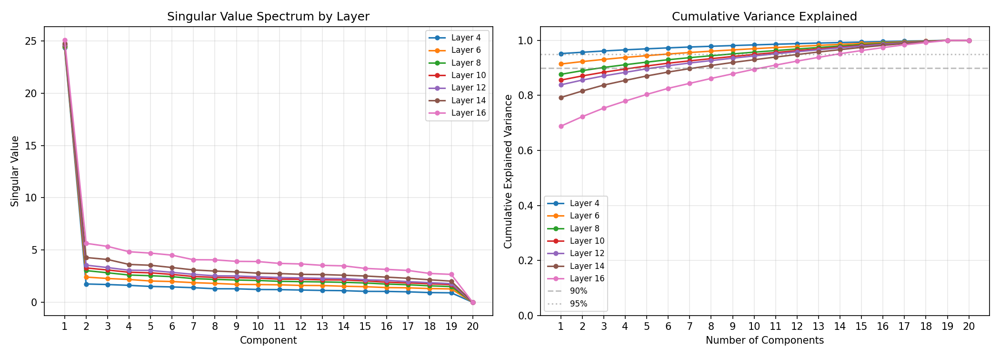
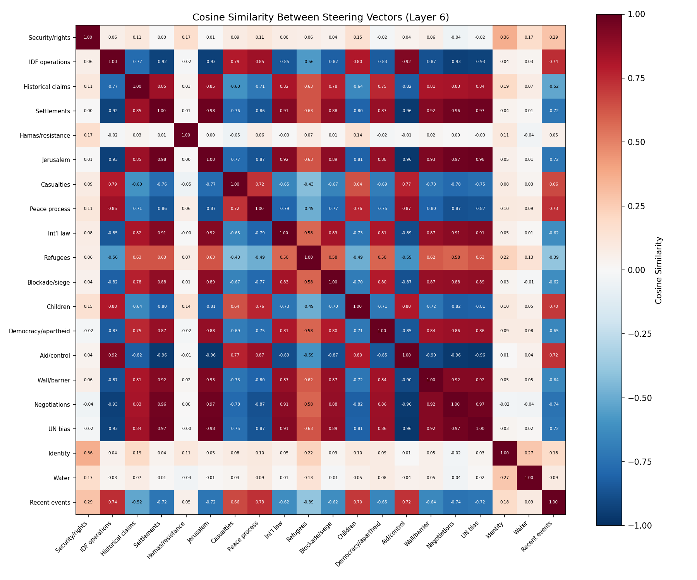

# SVD Analysis: Dimensionality of Perspective in Activation Space

## The Question

Our [sweep experiment](RESULTS.md) showed that a single steering vector can shift the Israel/Palestine framing of Llama 3 8B's output. But how much of "perspective" does one vector actually capture? Is geopolitical framing a single axis the model can be slid along, or a complex, multi-dimensional space where our experiment only found one slice?

To answer this, we computed steering vectors from **20 different contrastive prompt pairs** — each capturing a different facet of the conflict — and ran **Singular Value Decomposition (SVD)** to determine the effective dimensionality.

## Method

### What SVD tells us

SVD decomposes our matrix of 20 steering vectors (shape `20 × 4096`) into orthogonal principal components ranked by importance. Each component is a direction in 4096-dimensional activation space, and its **singular value** tells us how much of the total variance across all 20 vectors that direction captures.

- **Explained variance ratio**: What fraction of the total variance a single component accounts for. If PC1 explains 90%, then 90% of the "stuff" happening across all 20 different steering vectors can be described by one direction.
- **Effective rank at X%**: How many components you need to capture X% of the variance. rank_90 = 1 means one direction captures 90% of everything. rank_90 = 8 means you need 8 independent directions — "perspective" is genuinely multi-faceted.

### Contrastive prompt pairs

We chose 20 pairs covering different facets of how the conflict is framed:

| # | Facet | Pro-Israel Framing | Pro-Palestine Framing |
|---|-------|-------------------|----------------------|
| 1 | Security/rights | "Israel has the right to defend itself and ensure the security of its citizens" | "Palestine deserves freedom from occupation and the right to self-determination" |
| 2 | IDF operations | "The Israeli Defense Forces conducted a targeted operation against terrorist infrastructure" | "The Israeli military launched an assault on civilian areas in the occupied territories" |
| 3 | Historical claims | "The Jewish homeland and the historic right of the Jewish people to the land of Israel" | "The Palestinian homeland and the displacement of the Palestinian people from their ancestral land" |
| 4 | Settlements | "Israeli communities and neighborhoods built in Judea and Samaria" | "Illegal Israeli settlements constructed on occupied Palestinian territory" |
| 5 | Hamas/resistance | "Hamas terrorists launched rockets targeting Israeli civilian population centers" | "Palestinian resistance fighters responded to the ongoing military occupation" |
| 6 | Jerusalem | "Jerusalem is the eternal and undivided capital of the State of Israel" | "East Jerusalem is occupied Palestinian territory under international law" |
| 7 | Casualties | "Israel takes extraordinary measures to minimize civilian casualties using precision strikes" | "Israeli bombardment has caused massive civilian casualties and destruction in Gaza" |
| 8 | Peace process | "Israel has repeatedly offered generous peace proposals that were rejected by Palestinian leadership" | "Palestinians have been denied a viable state by continued Israeli expansion and occupation" |
| 9 | Int'l law | "Israel acts in accordance with its right to self-defense under international law" | "Israel's occupation and settlements violate international law and UN resolutions" |
| 10 | Refugees | "Jewish refugees expelled from Arab countries found safety and a new home in Israel" | "Palestinian refugees were expelled from their homes and denied the right of return" |
| 11 | Blockade/siege | "The security blockade of Gaza is necessary to prevent weapons smuggling by terrorist organizations" | "The siege of Gaza is collective punishment of two million Palestinian civilians" |
| 12 | Children | "Israeli children live under constant threat of rocket attacks and terrorism" | "Palestinian children grow up under military occupation and face daily violence" |
| 13 | Democracy/apartheid | "Israel is a vibrant democracy and the only free society in the Middle East" | "Israel operates an apartheid system with separate laws for Israelis and Palestinians" |
| 14 | Aid/control | "Israel provides humanitarian aid and medical treatment to Palestinian civilians" | "Israel controls Palestinian water, electricity, and movement, strangling economic development" |
| 15 | Wall/barrier | "The security barrier has saved countless Israeli lives by preventing suicide bombings" | "The separation wall annexes Palestinian land and divides communities" |
| 16 | Negotiations | "Palestinian leadership promotes incitement and refuses to recognize Israel's right to exist" | "Israeli leadership continues settlement expansion while claiming to seek peace negotiations" |
| 17 | UN bias | "The United Nations has an anti-Israel bias driven by an automatic majority of hostile states" | "The United Nations has repeatedly condemned Israeli violations of Palestinian rights" |
| 18 | Identity | "Israel is the nation-state of the Jewish people, a beacon of innovation and resilience" | "Palestine is a nation under occupation, its people denied basic rights and dignity" |
| 19 | Water | "Israel has developed world-leading water technology and shares resources with its neighbors" | "Israel diverts Palestinian water resources and restricts access for Palestinian communities" |
| 20 | Recent events | "Israel responded to an unprecedented terrorist attack to protect its citizens" | "Palestinians face unprecedented levels of destruction and displacement in Gaza" |

### Layers analyzed

Layers 4, 6, 8, 10, 12, 14, 16 — the effective range identified by our sweep.

---

## Results

### The headline: Perspective is overwhelmingly one-dimensional

At layer 6 (our best steering layer), **the first principal component explains 91.4% of all variance** across 20 different steering vectors. The second component explains just 0.89%. PC1 is **10.1x larger** than PC2.

This means that when you compute steering vectors from prompts about settlements, Jerusalem, refugees, casualties, international law, the blockade, children, the wall, negotiations, and 12 other facets — they are almost all variations of **the same direction** in activation space.

### Layer-by-layer breakdown

| Layer | PC1 Explains | SV1/SV2 Ratio | Rank (90%) | Rank (95%) | Rank (99%) |
|-------|-------------|---------------|-----------|-----------|-----------|
| 4 | **95.2%** | 13.9x | **1** | 1 | 13 |
| 6 | **91.4%** | 10.1x | **1** | 6 | 16 |
| 8 | 87.7% | 8.1x | 3 | 9 | 17 |
| 10 | 85.6% | 7.5x | 5 | 11 | 17 |
| 12 | 83.8% | 6.9x | 6 | 11 | 17 |
| 14 | 79.2% | 5.8x | 8 | 13 | 18 |
| 16 | 68.8% | 4.5x | 11 | 14 | 18 |

At every layer, a single direction dominates. The effect is strongest at early layers (95.2% at layer 4) and gradually diminishes deeper in the network (68.8% at layer 16), suggesting that later layers develop more nuanced, multi-dimensional representations.

Even at layer 16 — the worst case — one component still captures more variance than all other 19 combined.

### Singular value spectrum

The left plot shows the singular value spectrum: a massive first value (~25) followed by a sharp cliff to values of 1.5-5.5 for the remaining components. This "one spike then flat" pattern is the signature of a rank-1-dominated matrix.

The right plot shows cumulative explained variance. At layers 4-6, the curve hits 90% at component 1. At deeper layers, the curve rises more gradually but still reaches 90% within the first few components.

### Cosine similarity between steering vectors

The cosine similarity matrix at layer 6 reveals a striking pattern:

- **Mean cosine similarity: 0.040** (near zero)
- **Standard deviation: 0.633** (enormous)
- **Range: [-0.963, +0.980]**

A mean near zero with extreme spread means the vectors aren't scattered randomly — they are **nearly collinear but point in both directions** along the dominant axis. Some prompt pairs produce vectors with cosine similarity +0.98 (nearly identical direction), while others produce vectors at -0.96 (nearly opposite direction).

This is consistent with the SVD finding: a single dominant axis, but different prompt pairs map onto it with different polarities.

### What the cosine clusters mean

The heatmap shows blocks of strong positive correlation (blue, ~0.8-0.98) and strong negative correlation (red, ~-0.8 to -0.96). This means:

**Pairs that align (high positive cosine):** These facets produce steering vectors pointing the same way. Steering on one would have a similar effect to steering on the other. They are **entangled** — you cannot independently control one without moving the other.

**Pairs that anti-correlate (high negative cosine):** These facets produce steering vectors pointing in **opposite directions**. This doesn't mean they're independent — it means our labeling of "pro-Israel" vs "pro-Palestine" direction is **inverted** for these pairs relative to the dominant axis. The model's internal representation of the contrast doesn't always match the human-assigned polarity.

**Pairs near zero cosine (rare):** These would be genuinely independent facets. There are very few of these, confirming that most facets are entangled in one direction.

### Vector norms: Which facets have the strongest contrast?

The norm of each steering vector indicates how far apart the two framings are in activation space — a larger norm means the model represents the pro-Israel and pro-Palestine versions of that facet as more distinct.

| Facet | Norm | Interpretation |
|-------|------|---------------|
| **Jerusalem** | **14.00** | Most distinct contrast — the model separates these framings the most |
| **Settlements** | **10.43** | Very strong — "communities in Judea and Samaria" vs "illegal settlements" are far apart |
| **Negotiations** | **9.24** | Strong contrast in blame attribution |
| **Aid/control** | **9.18** | "Provides aid" vs "controls and strangles" — very different representations |
| **UN bias** | **9.16** | "Anti-Israel bias" vs "condemned violations" — strongly separated |
| Wall/barrier | 5.51 | Moderate |
| Int'l law | 4.82 | Moderate |
| IDF operations | 4.67 | Moderate |
| Democracy/apartheid | 4.30 | Moderate |
| Blockade/siege | 4.15 | Moderate |
| Peace process | 3.78 | Moderate |
| Historical claims | 3.41 | Moderate |
| Recent events | 3.25 | Lower |
| Casualties | 3.06 | Lower |
| Children | 2.88 | Lower |
| Refugees | 2.42 | Lower |
| Water | 1.97 | Weak — framings are close in activation space |
| Security/rights | 1.91 | Weak |
| Hamas/resistance | 1.82 | Weak |
| Identity | 1.78 | Weakest contrast |

The strongest contrasts (Jerusalem, settlements) involve **proper nouns and specific terminology** ("Judea and Samaria" vs "occupied territory", "eternal capital" vs "occupied territory under international law"). The weakest (identity, Hamas/resistance) involve more **abstract or ambiguous** concepts where the two framings may share more semantic overlap.

Note that the vector we used in our sweep experiment ("Security/rights") has one of the **lowest norms** (1.91) — it was actually one of the weakest contrasts available. The Jerusalem or settlements vector might produce stronger steering effects.

---

## What This Means

### 1. Perspective really is (mostly) one knob

At the layers where steering is effective (4-8), a single direction captures 88-95% of the variance across 20 different facets of the Israel/Palestine conflict. The model doesn't have 20 independent "opinion knobs" for settlements, refugees, international law, etc. It has **one master knob** that moves all of them together.

This is a strong empirical result. It means:
- Our single-vector steering experiment captured most of what there is to capture
- You cannot independently steer how the model frames settlements vs how it frames refugees — they're entangled
- The model has a remarkably simplified internal representation of this conflict's framing

### 2. The master axis corresponds to something like "security framing vs humanitarian framing"

Given that nearly all facet-specific vectors collapse onto one axis, that axis likely corresponds to the most prominent organizing dimension in the training data. Based on the sweep experiment's output analysis, this appears to be the **security/threat narrative vs humanitarian/rights narrative** axis — the dominant fault line in English-language media coverage of this conflict.

### 3. Deeper layers develop more nuance

The progression from 95.2% (layer 4) to 68.8% (layer 16) suggests that as information flows through the network, the model develops a more multi-dimensional representation of the conflict. At layer 16, you need 11 components for 90% variance — still dominated by PC1, but with meaningful secondary structure.

This aligns with the general understanding that early transformer layers handle more surface-level features while later layers develop more abstract, compositional representations.

### 4. The polarity inversion is important

Some prompt pairs produce vectors that anti-correlate with others (cosine ~ -0.96). This means the model's internal "pro-Israel vs pro-Palestine" axis doesn't perfectly align with every human-constructed contrast pair. Some aspects of the conflict that humans frame as "pro-Israel" might sit on the opposite side of the model's internal axis.

This is a cautionary note for steering vector research: the direction you intend to steer may not be the direction the model represents the concept in.

### 5. Implications for manipulation resistance

The one-dimensionality of perspective is both a vulnerability and an insight:

- **Vulnerability**: A single vector at one layer is sufficient to shift the model's framing across all facets of a complex geopolitical topic simultaneously. There is no need for 20 separate interventions.
- **Detection opportunity**: Because steering is so low-rank, it might be detectable. If a model's outputs across many prompts all shift along the same axis, that's a statistical signature of activation steering.
- **Fundamental limitation**: The model doesn't "reason" about each facet of the conflict independently. Its representation is more like a dial between two narrative poles than a rich, multi-dimensional understanding.

---

## Comparison: What would high-dimensional perspective look like?

For context, here's what our results would look like if perspective were genuinely multi-dimensional:

| Scenario | PC1 Explains | rank_90 | Cosine Sim Pattern |
|----------|-------------|---------|-------------------|
| **Our result (layer 6)** | **91.4%** | **1** | **±0.96 (collinear, both polarities)** |
| Moderate dimensionality | ~40% | 5-6 | Clustered, 0.3-0.6 within groups |
| High dimensionality | ~15% | 12+ | Low, 0.0-0.2 (mostly independent) |
| Random (no structure) | ~5% | 18+ | ~0 everywhere |

Our result is almost as extreme as theoretically possible for a rank-1 structure. The conflict's framing, as represented by Llama 3 8B at layer 6, is essentially a single number.

---

## Potential Next Steps

1. **Steer with the Jerusalem or settlements vector** instead of the security/rights vector we used in the sweep — these have 7-8x larger norms and might produce stronger effects at lower coefficients.

2. **Test whether the residual dimensions matter.** After removing PC1, do the remaining components (which capture 8.6% of variance at layer 6) correspond to meaningful, independently-steerable facets? Or is it just noise?

3. **Compare across models.** Is this one-dimensionality specific to Llama 3 8B, or is it a general feature of how LLMs represent contested topics? A comparison with Mistral, GPT-2, or a multilingual model trained on different source distributions would be informative.

4. **Test on other contested topics.** Is the Israel/Palestine conflict unusually one-dimensional because of how polarized the discourse is? Would a less binary topic (e.g., climate policy, immigration, AI regulation) show higher effective rank?

5. **Analyze the anti-correlated pairs.** Understanding why some facets have inverted polarity relative to the dominant axis could reveal how the model's internal representation differs from human-assumed framing categories.
